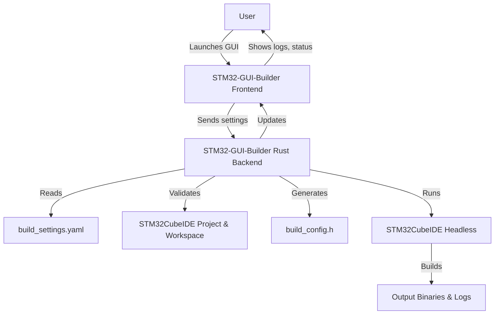
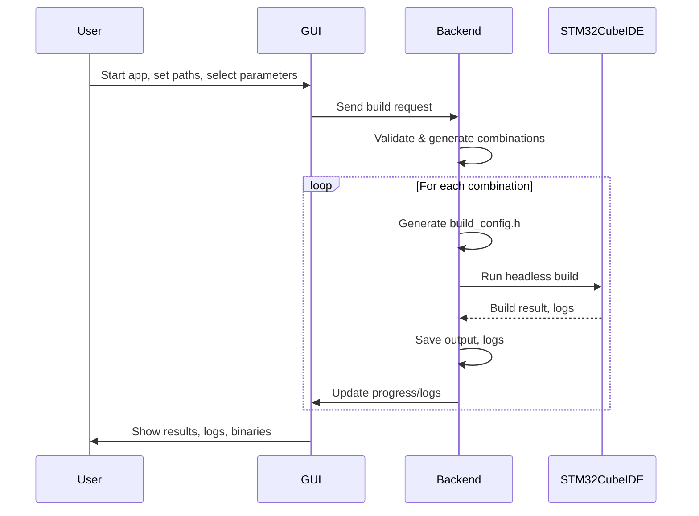

# How STM32-GUI-Builder Works

This document explains the overall workflow and architecture of STM32-GUI-Builder.

---

## Overview

STM32-GUI-Builder is a desktop application that automates and simplifies the process of building STM32CubeIDE projects with different configurations. It provides a graphical interface for selecting build parameters, manages the generation of configuration headers, and orchestrates headless builds using STM32CubeIDE.

---

## Main Workflow

---

## Interaction Blocks

### 1. User ↔️ GUI (Frontend)
- User sets paths and selects build parameters.
- GUI displays real-time logs and build progress.

### 2. GUI (Frontend) ↔️ Rust Backend
- Frontend sends configuration and build requests to backend via Tauri commands.
- Backend validates, generates files, and manages the build process.

### 3. Rust Backend ↔️ STM32CubeIDE
- Backend launches STM32CubeIDE in headless mode for each build combination.
- Monitors process, collects logs, and manages output files.

### 4. Rust Backend ↔️ File System
- Reads/writes `build_settings.yaml`, `build_config.h`, and build artifacts.
- Organizes output per build combination.

---

## Typical Use Case

---

## Limitations & Recommendations

- STM32CubeIDE must not be running during builds.
- All project settings and build configurations must be pre-configured in STM32CubeIDE.
- Only the defines inside the `#ifndef BUILD_CONFIG_H_ ... #endif` block in your header will be managed by the builder.

---

For more details, see [README.md](./README.md) and [USAGE.md](./USAGE.md).
